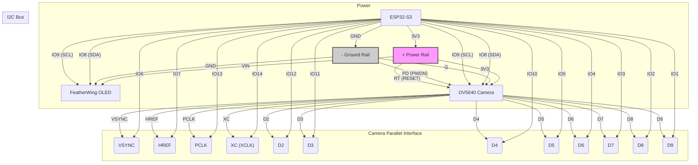

```mermaid
graph TD
    subgraph Power
        ESP32_S3["ESP32-S3"] -- "3V3" --> PowerRail["+ Power Rail"]
        ESP32_S3 -- "GND" --> GroundRail["- Ground Rail"]
        PowerRail -- "VIN" --> OLED["FeatherWing OLED"]
        GroundRail -- "GND" --> OLED
        PowerRail -- "3V3" --> Camera["OV5640 Camera"]
        GroundRail -- "G" --> Camera
    end

    subgraph I2C Bus
        ESP32_S3 -- "IO8 (SDA)" --> OLED
        ESP32_S3 -- "IO9 (SCL)" --> OLED
        ESP32_S3 -- "IO8 (SDA)" --> Camera
        ESP32_S3 -- "IO9 (SCL)" --> Camera
    end

    subgraph Camera Parallel Interface
        GroundRail -- "PD (PWDN)" --> Camera
        PowerRail -- "RT (RESET)" --> Camera
        ESP32_S3 -- "IO6" --> Camera_VSYNC("VSYNC")
        ESP32_S3 -- "IO7" --> Camera_HREF("HREF")
        ESP32_S3 -- "IO13" --> Camera_PCLK("PCLK")
        ESP32_S3 -- "IO14" --> Camera_XC("XC (XCLK)")
        ESP32_S3 -- "IO12" --> Camera_D2("D2")
        ESP32_S3 -- "IO11" --> Camera_D3("D3")
        ESP32_S3 -- "IO10" --> Camera_D4("D4")
        ESP32_S3 -- "IO5" --> Camera_D5("D5")
        ESP32_S3 -- "IO4" --> Camera_D6("D6")
        ESP32_S3 -- "IO3" --> Camera_D7("D7")
        ESP32_S3 -- "IO2" --> Camera_D8("D8")
        ESP32_S3 -- "IO1" --> Camera_D9("D9")

        Camera -- VSYNC --> Camera_VSYNC
        Camera -- HREF --> Camera_HREF
        Camera -- PCLK --> Camera_PCLK
        Camera -- XC --> Camera_XC
        Camera -- D2 --> Camera_D2
        Camera -- D3 --> Camera_D3
        Camera -- D4 --> Camera_D4
        Camera -- D5 --> Camera_D5
        Camera -- D6 --> Camera_D6
        Camera -- D7 --> Camera_D7
        Camera -- D8 --> Camera_D8
        Camera -- D9 --> Camera_D9
    end

    style PowerRail fill:#f9f,stroke:#333,stroke-width:2px
    style GroundRail fill:#ccc,stroke:#333,stroke-width:2px
```
